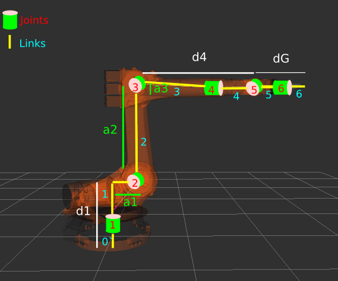
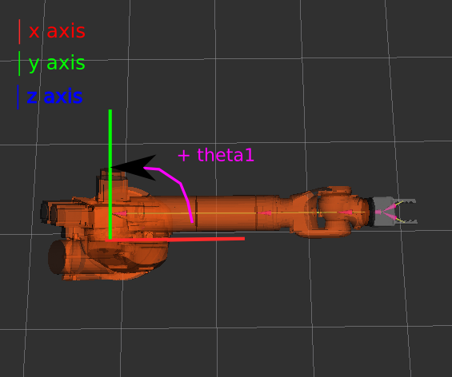
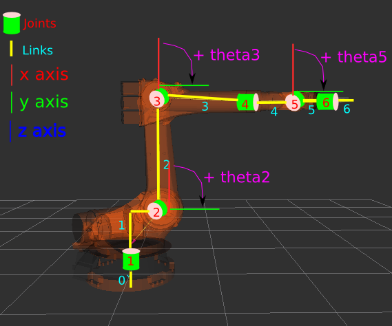
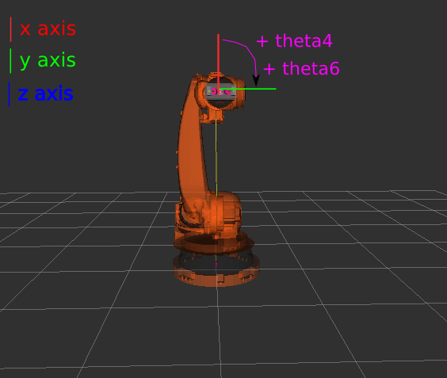
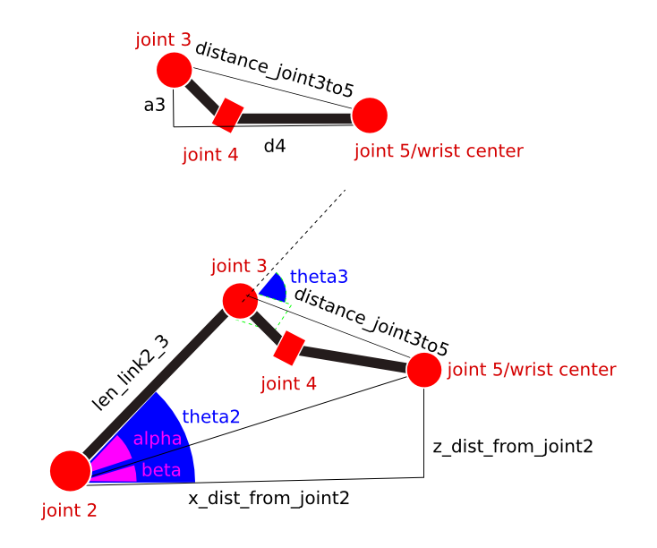
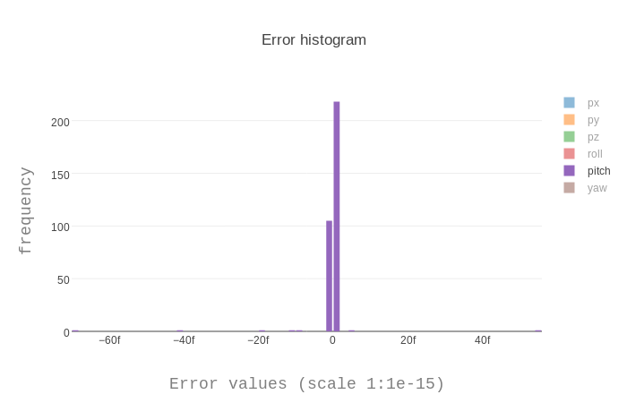
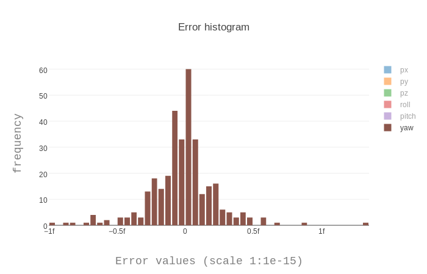
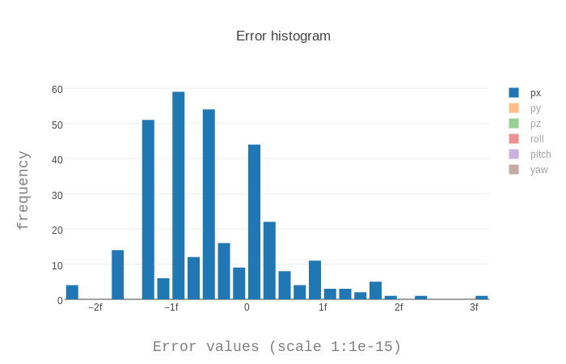

## Project: Kinematics Pick & Place

---

## [Rubric](https://review.udacity.com/#!/rubrics/972/view) Points

---

### Kinematic Analysis
#### DH Parameter Table

After evaluating the kr210.urdf.xacro file and running the forward_kinematics demo, here is the Kuka KR210's derived modified DH parameter table.

i   | alpha_{i-1} | a_{i-1} | d_{i}  | theta_{i}
--- | ---         | ---     | ---  | ---
1   | 0           | 0       | 0.75 |
2   | -pi/2       | 0.35    | 0    | -pi/2
3   | 0           | 1.25    | 0    |
4   | -pi/2       | -0.054  | 1.50 | 
5   | pi/2        | 0       | 0    |
6   | -pi/2       | 0       | 0    |
7   | 0           | 0       | 0.303| 0

The steps taken on how to derive the above table are based on Lesson 2, "Forward and Inverse Kinematics", part 13 "DH Parameter Assignment Algorithm". The "KR210 Forward Kinematics" lesson series under the "Pick and Place project" also provided a very useful guide in determining the DH table and parameters. The steps are restated below, with notes on how things were done in this specific instance, as well as images to help understand the procedure. DH parameter determination was done with all joint values at 0, and with the arm facing the right of the viewer.

1. Label all joints from 1, 2, to n
2. Label all links from 0, 1, to n starting with the fixed base link as 0.
3. Draw lines through all joints, defining the joint axes.
4. Assign the Z-axis of each frame to point along its joint axis.
5. Identify the common normal between each frame Z_{i-1} frame Z_{i}. This is accomplished by following these substeps:
    1. Identify the directions for the positive z axes. In this case, for revolute joint that are vertical, their z axes were made to point upwards. For revolute joints that are horizontal, these were made to point backwards(away from the viewer).
    2. Identify the common normal, that is the shortest orthogonal line between the previous z-axis and the current z-axis.
    3. Identify the directions for the positive x axes.  We make the x axes liedn along the common normal, and make the x axes point either to the right (of the viewer), or upwards.
6. Identify the origins of the frames. This is possible once we have the z and y axes. We can then identify the origin of the frames, by locating the intersection of the frame's x axis, with its z axis.
7. Identify the location and orientation of the gripper link.  In this case it has the same orientation as the link6, differing only in terms of a translation along the z6 axis.
8. We then proceed to identify the link lengths(a) and the link offsets(d)
    1. link_length_{i-1} or a{i-1} is the distance between z{i-1} to z{i} along the x{i-1} axis. For example the link length a_{0} value is the distance between z_{0} axis to z_{1} axis, measured along the x_{0} axis.
    2. link_offset_{i} or d{i} is the signed distance between x{i-1} to x_{i} measured along the z_{i} axis. For example, the link offset d_{1} is the signed distance between x_{0} to x_{1} measured along the z_{1} axis.
9. We next determine the twist angles (alpha_{i}). This is done by getting the angle between z_{i-1} and z_{i} measured about the x_{i-1} axis. For parallel joint axes, the twist angle is zero.
10. For the theta_{i} values, these are the difference in angles between x_{i-1} and x{i} measured around the z_{i} axis in the right hand manner. In our case, only theta_{2} has a constant offset value of -90 degrees, while the rest don't have any.
    
Below is an image with the DH parameters



Below is an image showing the theta direction of joint 1



Below is an image showing the theta direction of joints 2, 3, and 5



Below is an image showing the theta directions of joints 4 and 6




#### Individual Transformation Matrices of Each Joint

```python
# Tn_m where:
# n represents the previous link
# m represents the current link
# Other variables in the tables are:
# q represents the joint rotation value
# alpha, a, and d are values from the DH table represented by s
T0_1 = Matrix([ [               cos(q1),              -sin(q1),            0,                a0],
                [ sin(q1) * cos(alpha0), cos(q1) * cos(alpha0), -sin(alpha0), -sin(alpha0) * d1],
                [ sin(q1) * sin(alpha0), cos(q1) * sin(alpha0),  cos(alpha0),  cos(alpha0) * d1],
                [                     0,                     0,            0,                 1]])

T0_1 = T0_1.subs(s)

T1_2 = Matrix([ [               cos(q2),              -sin(q2),            0,                a1],
                [ sin(q2) * cos(alpha1), cos(q2) * cos(alpha1), -sin(alpha1), -sin(alpha1) * d2],
                [ sin(q2) * sin(alpha1), cos(q2) * sin(alpha1),  cos(alpha1),  cos(alpha1) * d2],
                [                     0,                     0,            0,                 1]])

T1_2 = T1_2.subs(s)

T2_3 = Matrix([ [               cos(q3),              -sin(q3),            0,                a2],
                [ sin(q3) * cos(alpha2), cos(q3) * cos(alpha2), -sin(alpha2), -sin(alpha2) * d3],
                [ sin(q3) * sin(alpha2), cos(q3) * sin(alpha2),  cos(alpha2),  cos(alpha2) * d3],
                [                     0,                     0,            0,                 1]])

T2_3 = T2_3.subs(s)

T3_4 = Matrix([ [               cos(q4),              -sin(q4),            0,                a3],
                [ sin(q4) * cos(alpha3), cos(q4) * cos(alpha3), -sin(alpha3), -sin(alpha3) * d4],
                [ sin(q4) * sin(alpha3), cos(q4) * sin(alpha3),  cos(alpha3),  cos(alpha3) * d4],
                [                     0,                     0,            0,                 1]])

T3_4 = T3_4.subs(s)

T4_5 = Matrix([ [               cos(q5),              -sin(q5),            0,                a4],
                [ sin(q5) * cos(alpha4), cos(q5) * cos(alpha4), -sin(alpha4), -sin(alpha4) * d5],
                [ sin(q5) * sin(alpha4), cos(q5) * sin(alpha4),  cos(alpha4),  cos(alpha4) * d5],
                [                     0,                     0,            0,                 1]])

T4_5 = T4_5.subs(s)

T5_6 = Matrix([ [               cos(q6),              -sin(q6),            0,                a5],
                [ sin(q6) * cos(alpha5), cos(q6) * cos(alpha5), -sin(alpha5), -sin(alpha5) * d6],
                [ sin(q6) * sin(alpha5), cos(q6) * sin(alpha5),  cos(alpha5),  cos(alpha5) * d6],
                [                     0,                     0,            0,                 1]])

T5_6 = T5_6.subs(s)

T6_G = Matrix([ [               cos(q7),              -sin(q7),            0,                a6],
                [ sin(q7) * cos(alpha6), cos(q7) * cos(alpha6), -sin(alpha6), -sin(alpha6) * d7],
                [ sin(q7) * sin(alpha6), cos(q7) * sin(alpha6),  cos(alpha6),  cos(alpha6) * d7],
                [                     0,                     0,            0,                 1]])

T6_G = T6_G.subs(s)
```

To combine all the forward kinematics transform matrices above, we multiple all of them together like so:

```python
T0_2 = simplify(T0_1 * T1_2)
T0_3 = simplify(T0_2 * T2_3)
T0_4 = simplify(T0_3 * T3_4)
T0_5 = simplify(T0_4 * T4_5)
T0_6 = simplify(T0_5 * T5_6)
T0_G = simplify(T0_6 * T6_G)
```
And finally, to correct the orientation of the gripper to match that of the base link and the world frame:

```python
T_total = T0_G * rotate_z(pi) * rotate_y(-pi/2)
```
#### Generalized homogenous transform between base_link and gripper_link using only end-effector pose

Below is the homogenous transform matrix of the end effector.  This matrix has not had its orientation corrected to match its original DH orientation

```python
# homogenous_Rrpy
Matrix([
[cos(pitch)*cos(yaw), sin(pitch)*sin(roll)*cos(yaw) - sin(yaw)*cos(roll), sin(pitch)*cos(roll)*cos(yaw) + sin(roll)*sin(yaw), px],
[sin(yaw)*cos(pitch), sin(pitch)*sin(roll)*sin(yaw) + cos(roll)*cos(yaw), sin(pitch)*sin(yaw)*cos(roll) - sin(roll)*cos(yaw), py],
[        -sin(pitch),                               sin(roll)*cos(pitch),                               cos(pitch)*cos(roll), pz],
[                  0,                                                  0,                                                  0,  1]])

```

Below is the homogenous transform matrix of the end effector corrected to be reoriented with the original DH orientation of the end effector:

```python
# corrected_Rrpy
Matrix([
[sin(pitch)*cos(roll)*cos(yaw) + sin(roll)*sin(yaw), -sin(pitch)*sin(roll)*cos(yaw) + sin(yaw)*cos(roll), cos(pitch)*cos(yaw), px],
[sin(pitch)*sin(yaw)*cos(roll) - sin(roll)*cos(yaw), -sin(pitch)*sin(roll)*sin(yaw) - cos(roll)*cos(yaw), sin(yaw)*cos(pitch), py],
[                              cos(pitch)*cos(roll),                               -sin(roll)*cos(pitch),         -sin(pitch), pz],
[                                                 0,                                                   0,                   0,  1]])

```


Below we show how both matrices were derived using sympy
```python
def rotate_x(rads):
    rotated = Matrix([
        [1, 0, 0, 0],
        [0, cos(rads), -sin(rads), 0],
        [0, sin(rads), cos(rads), 0],
        [0, 0, 0, 1]
    ])

    return rotated


def rotate_z(rads):
    rotated = Matrix([
        [cos(rads), -sin(rads), 0, 0],
        [sin(rads), cos(rads), 0, 0],
        [0, 0, 1, 0],
        [0, 0, 0, 1]
    ])

    return rotated


def rotate_y(rads):
    rotated = Matrix([
        [cos(rads), 0, sin(rads), 0],
        [0, 1, 0, 0],
        [-sin(rads), 0, cos(rads), 0],
        [0, 0, 0, 1]
    ])

    return rotated

roll = symbols('roll')
pitch = symbols('pitch')
yaw = symbols('yaw')

px = symbols('px')
py = symbols('py')
pz = symbols('pz')

rot_x = rotate_x(roll)[0:3, 0:3]
rot_y = rotate_y(pitch)[0:3, 0:3]
rot_z = rotate_z(yaw)[0:3, 0:3]

Rrpy = rot_z * rot_y * rot_x

homogenous_Rrpy = Rrpy
homogenous_Rrpy = homogenous_Rrpy.col_insert(4, Matrix([px, py, pz]))
homogenous_Rrpy = homogenous_Rrpy.row_insert(4, Matrix([[0, 0, 0, 1]]))

print(homogenous_Rrpy)

corrected_Rrpy = Rrpy * rotate_y(pi / 2)[0:3, 0:3] * rotate_z(pi)[0:3, 0:3]
corrected_Rrpy = corrected_Rrpy.col_insert(4, Matrix([px, py, pz]))
corrected_Rrpy = corrected_Rrpy.row_insert(4, Matrix([[0, 0, 0, 1]]))

print(corrected_Rrpy)

```

#### Equations For the Positional Joint Angles theta1 to theta3

##### 0. Preliminaries
The first thing to do is to compute the value of the wrist coordinates. These wrist coordinates will then be used in the computation of the thetas 1, 2, and 3.

```python
# variable definitions:
# Rrpy is the (uncorrected) matrix we have obtained using the pose information of the end effector
# lx, ly, lz are the variables that comprise the first column of the Rrpy matrix. Representing a transform along the x axis of the world frame.
# px, py, pz ar the given end effector corrdinates
# dist_wrist_to_effector is comprised of the effector length, d7 in the DH matrix added to d6.
# wx, wy, wz are the variables that will hold the computed wrist coordinates.
lx = Rrpy[0, 0]
ly = Rrpy[1, 0]
lz = Rrpy[2, 0]

wx = px - (dist_wrist_to_effector * lx)
wy = py - (dist_wrist_to_effector * ly)
wz = pz - (dist_wrist_to_effector * lz)
```


#### 1. Theta 1
Theta 1 is the rotation of the robot arm along its base joint.  It's the joint the allows the arm to rotate left or right. Computation of the formula is fairly straightforward, requiring only the x and y coordinates of the wrist center.

```python
# variable definitions
# wy, wx are the y and x coordinates of the wrist
# theta1 is the variable that will hold the value of theta1
theta1 = atan2(wy, wx)
```

#### 2. Theta 3
Thetas 2 and 3 allow the arm to reach forwards, upwards, downwards, and backwards. First to be computed is theta3, using the cosine law.  Once we have theta3, we determine the remaining angle necessary to reach the position, and assign this value to theta2.



```python
# compute the side adjacents of theta 3
# len_link2_3 is basically a fixed length.  This is the length of the link connecting joint 2 and joint 3. The value can be obtained from the DH table as a2
# distance_joint_3to5 is also a fixed length.  However, since there is no single link that joins the 2 joints in a straight line, we will have to compute the distance using the pythagorean theorem
len_link2_3 = s[a2]
distance_joint_3to5 = sqrt((s[a3] ** 2) + (s[d4] ** 2))

# get the offsets to the origin of joint 2
# these offsets are the fixed x and z distance between the base origin, and the origin of joint 2. We need to get these so that we can make sure that we discount these values when we do any calculations for theta2 and theta3.
x_offset_to_joint2 = s[a1]
z_offset_to_joint2 = s[d1]

# compute for the elbow up value of theta 3
# we compute the x and z distance of the wrist from joint 2. The intuitive thing to do would be to set joint 2 as the 0,0 origin of any trigonometric operations we will do. we can do this by subtracting the offsets from any distance we obtain before using them. For x measurements, we also make sure that we adjust it by how much theta1 is rotated. We can accomplish this by dividing wx with the cosine of the theta1 value we have.

x_dist_from_joint2 = (wx / cos(theta1)) - joint_2_x_offset
z_dist_from_joint2 = wz - joint_2_z_offset

# now that we know the lengths of both of the sides adjacent to theta 3, as well as the x and z wrist coordinates, we can proceed to compute theta3 using the law of cosines.
# the solution used here was adapted from: https://www.youtube.com/watch?v=llUBbpWVPQE time at 4:49
numerator = (x_dist_from_joint2 ** 2) + (z_dist_from_joint2 ** 2) - (len_link2_3 ** 2) - (distance_joint3to5 ** 2)
denominator = (2 * len_link2_3 * distance_joint3to5)

cos_theta = numerator / denominator

# the first conditional is meant to check if cos_theta is greater than 1.  If it is, then we make necessary adjustments to prevent imaginary numbers being produced
if cos_theta > 1:
    mod_cos_theta = cos_theta - 1
    theta_3_elbow_up = atan2(+sqrt(1 - (mod_cos_theta ** 2)), mod_cos_theta) - (pi / 2)
    theta_3_elbow_down = atan2(-sqrt(1 - (mod_cos_theta ** 2)), mod_cos_theta) - (pi / 2)
# if however cos_theta is equal to or less than 1, all is as things should be, and we can then proceed to compute the value of theta3 using atan2 
else:
    theta_3_elbow_up = atan2(+sqrt(1 - (cos_theta ** 2)), cos_theta)
    theta_3_elbow_down = atan2(-sqrt(1 - (cos_theta ** 2)), cos_theta)

# we use theta_3_elbow up because it is normally the elbow configuration closest to the zero position of our robot arm.
unadjusted_theta3 = theta_3_elbow_up
# to obtain the final value of theta3, we adjust it using the RADS_AT_REST_JOINT3 offset. This offset was obtained by determining the default theta3 value of the arm when joint3 is at zero rotation.
RADS_AT_REST_JOINT3 = 1.60678078687695
theta3 = unadjusted_theta3.evalf() - RADS_AT_REST_JOINT3
```

#### 3. Theta 2
Once we have theta3, we determine the remaining rotation we need to obtain the desired wrist coordinates.  We assign that remaining rotation to theta2. Obtaining theta 2 however, involves obtaining the value of 2 angles, beta and alpha.  These should not be confused with the beta and alpha rotations that are associated with the wrist. The beta angle in this case is the angle from the baseline to the line drawn from joint 2 to the present wrist coordinates.  The alpha angle on the other hand is the angle between the line from joint 2 to the wrist coordinates and the link joining joint 2 and 3. Once we have both values, we proceed to add the two, to obtain the total rotation necessary for theta2.

```python
# we compute the values of the wrist coordinates, and adjust the x coordinate according to the value of theta1
x_dist_from_joint2 = (wx / cos(q1)) - joint_2_x_offset
z_dist_from_joint2 = wz - joint_2_z_offset

# we get the values of the 3 sides of the triangle. The two adjacent angles to the alpha angle, and the side opposite to the alpha angle
side_adj1 = len_link2_3
side_adj2 = sqrt((x_dist_from_joint2 ** 2) + (z_dist_from_joint2 ** 2))
side_opp = distance_joint3to5

# we use the cosine law to obtain the cos_alpha value
numerator = (side_opp ** 2) - (side_adj1 ** 2) - (side_adj2 ** 2)
denominator = -2 * side_adj1 * side_adj2
cos_alpha = numerator / denominator

# the first conditional once again checks if cos_alpha is greater than 1. If it is, we make the necessary adjustements to avoid the production of imaginary numbers
if cos_alpha > 1:
    mod_cos_alpha = cos_alpha - 1
    alpha_up = atan2(+sqrt(1 - (mod_cos_alpha ** 2)), mod_cos_alpha) - (pi / 2)
    alpha_down = atan2(-sqrt(1 - (mod_cos_alpha ** 2)), mod_cos_alpha) - (pi / 2)
# if we have a normal value for cos_alpha, then we obtain the value of alpha using the normal means.         
else:
    alpha_up = atan2(+sqrt(1 - (cos_alpha ** 2)), cos_alpha)
    alpha_down = atan2(-sqrt(1 - (cos_alpha ** 2)), cos_alpha)

# we use alpha up in this case, to make our choice consistent with the option we made with theta3
alpha = alpha_up
```
Next, we compute for the value of beta, that is, the angle to the line from joint 2 as the origin, and the wrist as the end point.

```python
# we once again compute for the coordinates of the wrist, and adjust the x coordinate based on the value of theta1
x_dist_from_joint2 = (wx / cos(q1)) - a1
z_dist_from_joint2 = wz - d1

# we then use atan2 to get the angle value of beta
beta = atan2(z_dist_from_joint2, x_dist_from_joint2)

```

And once we have both alpha and beta, we add the two to obtain the unadjusted thata2. We also proceed to adjust the value with a fixed offset to get the final theta2
```python
# add beta and alpha
unuadjusted_theta_2 = beta + alpha

# adjust with the fixed offset to obtain theta2
RADS_AT_REST_JOINT2 = pi/2 # 1.57079632679490
theta2 = RADS_AT_REST_JOINT2 - unadjusted_theta_2
theta2 = theta2.evalf()
```

### Equations for the Orientational Joint Angles theta4 to theta6

#### 0. Preliminaries
If it was important to compute for the wrist coordinates when determining the positional thetas, when it comes to determine the orientational thetas of the wrist, it's important to make sure that we are working with a rotational matrix with a frame that is correctly oriented to its gripper's DH orientation, and not to the base link's frame. Otherwise, we will not be successful in obtaining the theta values even if we use the correct equations for these thetas. Furthermore, regarding these correct equations, these will be derived not in the same manner we did with thetas 1 to 3 where we used trigonometry and triangles.  Instead, we will be using the approach given in our lessons. That is, produce a rotational matrix representing the wrist, and then, choose and manipulate the matrix elements that will provide us with the correct theta values.

##### 0.1 Obtaining the correct formulas for thetas 4, 5, and 6
The first step is to produce the rotation matrix from where we will build the equations from.  We use some of our code in forward kinematics to help us in this instance.

```python
# T3_4, T4_5, T5_6 are the individual rotational transforms we build for these three thetas in the Forward Kinematics part of the project 
print simplify(T3_4 * T4_5 * T5_6)

# This should output the following matrix:
Matrix([
[-sin(q4)*sin(q6) + cos(q4)*cos(q5)*cos(q6), -sin(q4)*cos(q6) - sin(q6)*cos(q4)*cos(q5), -sin(q5)*cos(q4), -0.054],
[                           sin(q5)*cos(q6),                           -sin(q5)*sin(q6),          cos(q5),    1.5],
[-sin(q4)*cos(q5)*cos(q6) - sin(q6)*cos(q4),  sin(q4)*sin(q6)*cos(q5) - cos(q4)*cos(q6),  sin(q4)*sin(q5),      0],
[                                         0,                                          0,                0,      1]])
```

With the above matrix, we should be able to pick out elements we can manipulate to provide use with the desired values of theta4(q4), theta5(q5), theta6(q6). For theta4, we can use the following elements:

```python
# element 2,2 is sin(q4)*sin(q5)
# element 0,2 is -sin(q5)*cos(q4)
# if we can simply cancel the sign of the second element, we can cancel out the presence of sin(q5) when dividing one with the other.  This would leave us with sin(q4) and cos(q4).  Now we get the atan2 of the two, with sin(q4) as the "y" paramter, and cos(q4) as the "x" parameter
# theta4 = atan2(sin(q4)*sin(q5), -(-sin(q5)*cos(q4)))
theta4 = atan2(R3_6[2, 2], -R3_6[0, 2])
```

For theta5, we can use the following elements:
```python
# element 1,2 is cos(q5)
# we can simply reverse cos(q5) with an acos to get the theta5 value
# theta5 = acos(cos(q5))
theta5 = acos(R3_6[1, 2])
```

For theta6, we can use the following elements:
```python
# element 1, 1 is -sin(q5)*sin(q6)
# element 1, 0 is sin(q5)*cos(q6)
# we reverse the sign of element 1,1, and we can cancel out sin(q5) when dividing the two elements with each other. we are left with cos(q6) and sin(q6). We then get the atan2 of the two elements, by using sin(q6) as the "y" paramater, and cos(q6) as the "x" parameter.
# theta6 = atan2(-(-sin(q5)*sin(q6)), sin(q5)*cos(q6))
theta6 = atan2(-R3_6[1, 1], R3_6[1, 0])
```

##### 0.2 Correcting the orientation of the Rrpy rotation matrix
Apart from getting the correct formulas for the last three thetas, we also need to make sure that the rotation matrix that we are working with has the correct orientation.  As of now, the matrix we have has its x, y, and z axes that are based on the base link, or Rviz's axes.  What we want instead is for it to have its axes to be based on the end effector or the gripper's axes.  To do this what we do is we reverse the correctional rotations we did to the End effector gripper when we did the Forward Kinematics portion of the project.  It can be recalled that this is how we previously corrected the orientation in the Forward Kinematics portion:
 
```python
# rotate by 180 degres in the z axis, the rotate -90 degrees in the y axis
T_total = T0_G * rotate_z(pi) * rotate_y(-pi/2)
```
To return to the original gripper orientation, we simply need to do the rotations in reverse:
```python
# rotate +90 degrees in the y axis, then rotate 180 degrees in the z axis
corrected_Rrpy = Rrpy * rotate_y(pi / 2)[0:3, 0:3] * rotate_z(pi)[0:3, 0:3]
```
Once we've corrected our Rrpy rotation matrix, we can then proceed to use the formulas on it.

#### 1. Obtaining the values of thetas 4, 5, and 6

To get the values for thetas 4 to 6, these are the steps to do so:

```python
# frist, we get the matrix for base link to joint 3, using computed theta1, 2, and 3 values
R0_3 = T0_3[0:3, 0:3]
R0_3 = R0_3.evalf(subs={q1: theta1, q2: theta2, q3: theta3})

# next correct the orientation of the Rrpy matrix, make its axes align with the DH axes of the gripper
Rrpy = Rrpy * rotate_y(pi / 2)[0:3, 0:3] * rotate_z(pi)[0:3, 0:3]
# get the Rrpy matrix values for the wrist, by multiplying the current Rrpy matrix with the inverse of the R0_3 matrix
R3_6 = Transpose(R0_3) * Rrpy

# now that we have the proper matrix, compute values for thetas 4, 5, and 6
theta4 = atan2(R3_6[2, 2], -R3_6[0, 2])
theta4 = theta4.evalf()
theta5 = acos(R3_6[1, 2])
theta5 = theta5.evalf()
theta6 = atan2(-R3_6[1, 1], R3_6[1, 0])
theta6 = theta6.evalf()

```

### Checking accuracy of the results
To check the accuracy of our results, we can run a forward kinematics run using our resultant thetas 1 to 6. From the resultant matrix, we should be able to successfully extract our beginning px, py, px, roll, pitch, and yaw values.

```python
forward_kinematics_matrix = T_total.evalf(subs={q1: theta1, q2: theta2, q3: theta3, q4: theta4, q5: theta5, q6: theta6})

FK_px = forward_kinematics_matrix[0, 3]
FK_py = forward_kinematics_matrix[1, 3]
FK_pz = forward_kinematics_matrix[2, 3]
print("expected px  ", px)
print("FK_px        ", FK_px)
print("expected py  ", py)
print("FK_py        ", FK_py)
print("expected pz  ", pz)
print("FK_pz        ", FK_pz)

FK_roll = get_roll(forward_kinematics_matrix)
FK_pitch = get_pitch(forward_kinematics_matrix)
FK_yaw = get_yaw(forward_kinematics_matrix)

print("expected roll    ", roll)
print("FK_roll          ", FK_roll)
print("expected pitch   ", pitch)
print("FK_pitch         ", FK_pitch)
print("expected yaw     ", yaw)
print("FK_yaw           ", FK_yaw)
```

In the case of this project, given inputs from Gazebo and Rviz, error results obtained have the absolute values of 1e-15 and lower.
Roll error


Pitch error



Yaw error



X coordinate error



Y coordinate error


Z coordinate error


